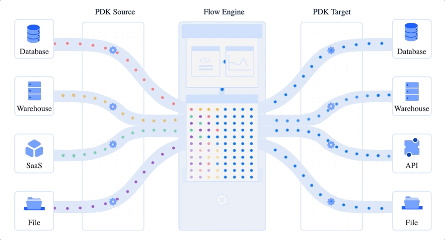

# iDaaS PDK


[](https://www.apache.org/licenses/LICENSE-2.0.html)


## What is iDaaS

Data as a service (DaaS) is a data management strategy that uses the cloud(or centralized data platform) to deliver data storage, integration, processing, and servicing capabilities in an on demand fashion.

Tapdata iDaaS, or Incremental Data as a Service, is an open source implementation of the DaaS architecture that puts focus on the incremental updating capability of the data platform.  In essense, iDaaS provides following capabilities:


- Searchable data catalog, allows you to collect/manage/organize and search for all your data assets across your organization

- "Any to Any" real time data integration platform, allows you to move data from source systems to DaaS or to destinations like data warehouses or kafka

- Programmable data platform, every data related tasks can be managed & programmed via API or Shell

- Code-less API generation, instantly turn your managed data asset into discoverable services

## What is PDK for iDaaS

**PDK is Plugin Development Kit for iDaaS.** Provide an easier way to develop data source connectors  
* **Database connectors** 
  * MySql, Oracle, Postgres, etc. 
* **SaaS connectors** 
  * Facebook, Salesforce, Google docs, etc.
* **Custom connectors**
  * Connect your custom data sources.

PDK connectors provide data source to flow in iDaaS pipeline to process, join, etc, and flow in a target which is also provided by PDK connectors.


**Should have a diagram to help people understand** that PDK connectors are the leaf nodes in iDaaS DAG


## Quick Start
Java 8+ and Maven need to be installed.

Generate Java Sample Project, then start filling the necessary methods to implement a PDK connector. 
```java
@TapConnectorClass("spec.json")
public class SampleConnector extends ConnectorBase implements TapConnector {
    /**
     * The method invocation life circle is below,
     * initiated -> discoverSchema -> ended
     *
     * You need to create the connection to your data source and release the connection after usage in this method.
     * In connectionContext, you can get the connection config which is the user input for your connection application, described in your json file.
     *
     * Consumer can accept multiple times, especially huge number of table list.
     * This is sync method, once the method return, Flow engine will consider schema has been discovered.
     *
     * @param connectionContext
     * @param consumer
     */
    @Override
    public void discoverSchema(TapConnectionContext connectionContext, Consumer<List<TapTable>> consumer) {
        //TODO Load schema from database, connection information in connectionContext#getConnectionConfig
        //Sample code shows how to define tables with specified fields.
        consumer.accept(list(
                //Define first table
                table("empty-table1")
                        //Define a field named "id", origin field type, whether is primary key and primary key position
                        .add(field("id", "VARCHAR").isPrimaryKey(true).partitionKeyPos(1))
                        .add(field("description", "TEXT"))
                        .add(field("name", "VARCHAR"))
                        .add(field("age", "DOUBLE"))
        ));
    }

    /**
     * The method invocation life circle is below,
     * initiated -> connectionTest -> ended
     * 
     * You need to create the connection to your data source and release the connection after usage in this method.
     * In connectionContext, you can get the connection config which is the user input for your connection application, described in your json file.
     *
     * consumer can call accept method multiple times to test different items
     *
     * @param connectionContext
     * @return
     */
    @Override
    public void connectionTest(TapConnectionContext connectionContext, Consumer<TestItem> consumer) {
        //Connection test
        //TODO execute connection test here
        consumer.accept(testItem(TestItem.ITEM_CONNECTION, TestItem.RESULT_SUCCESSFULLY));
    }

    /**
     * The method invocation life circle is below,
     * initiated ->
     *  if(batchEnabled)
     *      batchCount -> batchRead
     *  if(streamEnabled)
     *      streamRead
     * -> destroy -> ended
     * 
     * In connectorContext,
     * you can get the connection/node config which is the user input for your connection/node application, described in your json file.
     * current instance is serving for the table from connectorContext.
     *
     * @param connectorContext
     * @param offset
     * @param consumer
     */
    private void batchRead(TapConnectorContext connectorContext, Object offset, Consumer<List<TapEvent>> consumer) {
        //TODO batch read all records from database, use consumer#accept to send to flow engine.
        //Below is sample code to generate records directly.
        for (int j = 0; j < 1; j++) {
            List<TapEvent> tapEvents = list();
            for (int i = 0; i < 20; i++) {
                TapInsertRecordEvent recordEvent = insertRecordEvent(map(
                        entry("id", counter.incrementAndGet()),
                        entry("description", "123"),
                        entry("name", "123"),
                        entry("age", 12)
                ), connectorContext.getTable());
                tapEvents.add(recordEvent);
            }
            consumer.accept(tapEvents);
        }
    }

    /**
     * The method invocation life circle is below,
     * initiated ->
     *  if(batchEnabled)
     *      batchCount -> batchRead
     *  if(streamEnabled)
     *      streamRead
     * -> destroy -> ended
     * 
     * In connectorContext,
     * you can get the connection/node config which is the user input for your connection/node application, described in your json file.
     * current instance is serving for the table from connectorContext.
     *
     * @param connectorContext
     * @param offset
     * @param consumer
     */
    private void streamRead(TapConnectorContext connectorContext, Object offset, Consumer<List<TapEvent>> consumer) {
        //TODO using CDC APi or log to read stream records from database, use consumer#accept to send to flow engine.
        //Below is sample code to generate stream records directly
        while(!isShutDown.get()) {
            List<TapEvent> tapEvents = list();
            for (int i = 0; i < 10; i++) {
                TapInsertRecordEvent event = insertRecordEvent(map(
                        entry("id", counter.incrementAndGet()),
                        entry("description", "123"),
                        entry("name", "123"),
                        entry("age", 12)
                ), connectorContext.getTable());
                tapEvents.add(event);
            }
            consumer.accept(tapEvents);
        }
    }

    /**
     * The method invocation life circle is below,
     * initiated ->
     *  if(needCreateTable)
     *      createTable
     *  if(needClearTable)
     *      clearTable
     *  writeRecord
     * -> destroy -> ended
     *
     * @param connectorContext
     * @param tapRecordEvents
     * @param consumer
     */
    private void writeRecord(TapConnectorContext connectorContext, List<TapRecordEvent> tapRecordEvents, Consumer<WriteListResult<TapRecordEvent>> consumer) {
        //TODO write records into database
        //Need to tell flow engine the write result
        consumer.accept(writeListResult()
                .insertedCount(tapRecordEvents.size()));
    }
}
```
Each connector need to provide a json file like above, described in TapConnector annotation. 

spec.json describes three types information,  
* properties
    - Connector name, icon and id.
* configOptions
    - Describe a form for user to input the information for how to connect and which database to open. 
* openTypes (Not ready yet)
    - This will be required when current data source need create table with proper types before insert records. Otherwise this key can be empty.    
    - Describe the capability of types for current data source. 
    - iDaaS Flow Engine will generate proper types when table creation is needed. 
    
```json
{
  "properties": {
    "name": "PDK Sample Connector",
    "icon": "icon.jpeg",
    "id": "pdk-sample"
  },
  "configOptions": {
    "connection": {
      "type": "object",
      "properties": {
        "token": {
          "type": "string",
          "title": "Host",
          "x-decorator": "FormItem",
          "x-component": "Input"
        },
        "spaceId": {
          "type": "string",
          "title": "Database",
          "x-decorator": "FormItem",
          "x-component": "Input"
        }
      }
    }
  }, 
  "openTypes" : {
    
  }
}

```

## Installation
Java 8+ and Maven need to be installed.

**[How to build my own PDK connector?](docs/deployment.md)**

## Open types
Open types are the middle types across all data sources. 

The open types we call [TapType](docs/open-type.md).  


## Development Guide
[TapType](docs/development.md)

## Test Driven Development

## PDK Registration

